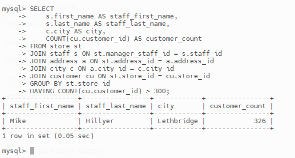
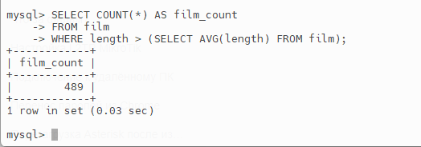
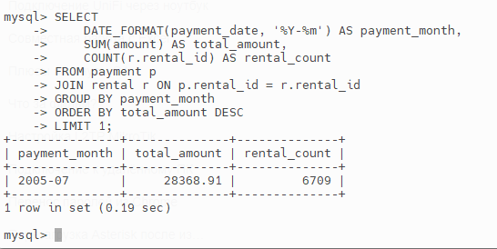
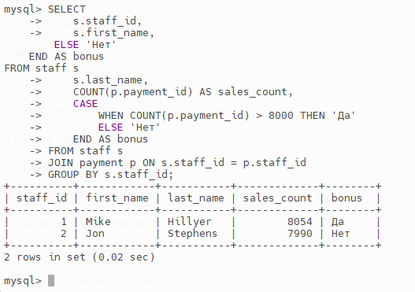
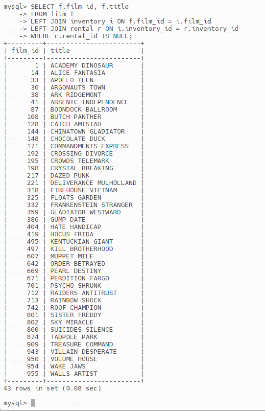

# Домашнее задание к занятию "SQL. Часть 2"

### Задание 1
#### Информация о магазине с более чем 300 покупателями
```
SELECT 
    s.first_name AS staff_first_name,
    s.last_name AS staff_last_name,
    c.city AS city,
    COUNT(cu.customer_id) AS customer_count
FROM store st
JOIN staff s ON st.manager_staff_id = s.staff_id
JOIN address a ON st.address_id = a.address_id
JOIN city c ON a.city_id = c.city_id
JOIN customer cu ON st.store_id = cu.store_id
GROUP BY st.store_id
HAVING COUNT(cu.customer_id) > 300;
  ```
Магазин с более чем 300 покупателями 

### Задание 2
#### Количество фильмов, чья продолжительность больше средней
```
SELECT COUNT(*) AS film_count
FROM film
WHERE length > (SELECT AVG(length) FROM film);
  ```
Фильмы 

### Задание 3
#### Месяц с максимальной суммой платежей и количество аренд
```
SELECT 
    DATE_FORMAT(payment_date, '%Y-%m') AS payment_month,
    SUM(amount) AS total_amount,
    COUNT(r.rental_id) AS rental_count
FROM payment p
JOIN rental r ON p.rental_id = r.rental_id
GROUP BY payment_month
ORDER BY total_amount DESC
LIMIT 1;
```
Месяц 

### Задание 4
#### Количество продаж по каждому продавцу + колонка «Премия»
```
SELECT 
    s.staff_id,
    s.first_name,
    s.last_name,
    COUNT(p.payment_id) AS sales_count,
    CASE 
        WHEN COUNT(p.payment_id) > 8000 THEN 'Да'
        ELSE 'Нет'
    END AS bonus
FROM staff s
JOIN payment p ON s.staff_id = p.staff_id
GROUP BY s.staff_id;
  ```
Количество продаж 

### Задание 5
#### Фильмы, которые ни разу не брали в аренду
```
SELECT f.film_id, f.title
FROM film f
LEFT JOIN inventory i ON f.film_id = i.film_id
LEFT JOIN rental r ON i.inventory_id = r.inventory_id
WHERE r.rental_id IS NULL;
  ```
Фильмы, которые ни разу не брали в аренду 
